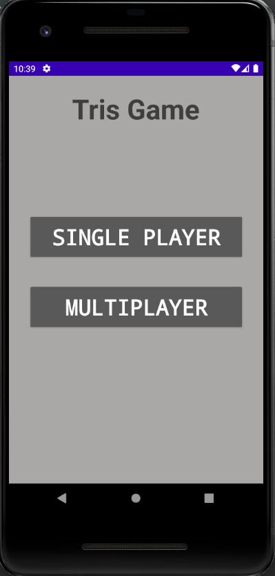
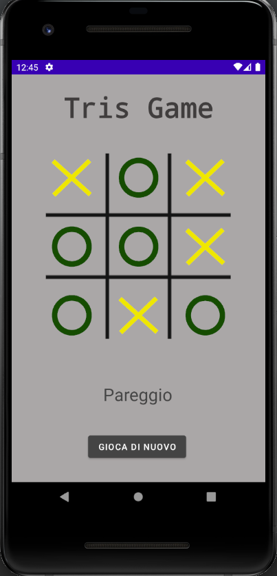

# Android Tris Game
Simple tic tac toe game built in Java with Android Studio. The purpose of this project is to teach how to build a very basic game with a very basic AI algorithm.
## Screenshots
 
# LICENSE
This code is completely free; <a href="LICENSE" >see GNU General Public License</a>.
